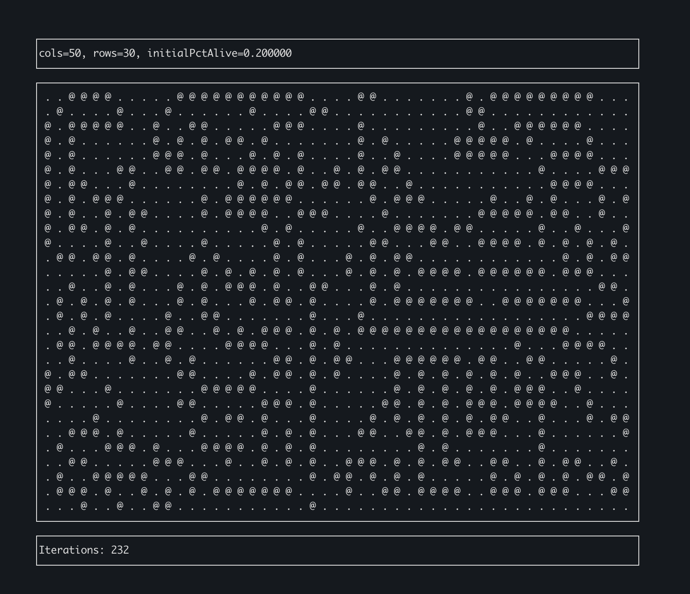

# Game of Life

A simple playground for implementing Conway's Game of Life in Go.



```sh
$ go run .

# display help
$ go run . --help
Usage of /path/to/golgo
  -cols int
    	width of grid (default 50)
  -initialPctAlive float
    	initial percentage of alive cells (default 0.25)
  -rows int
    	height of grid (default 30)
  -speed int
    	tick speed in millis (default 300)
```

Some ideas for extending:
* [done] Use some kind of ncurses or GUI to display the automata
* Parallel processing of grid
* Colors?
* [done] Config/flags/etc. for size
* Random seed
